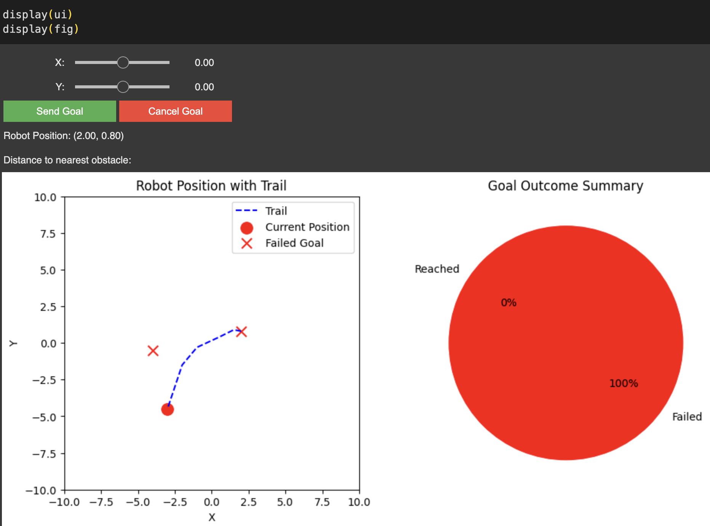

# assignment_2_2024 – Jupyter Project

This project implements a robot navigation system in ROS in a Gazebo simulation.
The robot receives (x, y) goal positions, moves toward them and reports status through a Jupyter Notebook interface that replaces the original `action_client.py` node.

## How to launch

1. Build and source the workspace:

```bash
cd ~/catkin_ws
catkin_make
source devel/setup.bash
```

2. Launch the simulation and all ROS nodes:

```bash
roslaunch assignment_2_2024 assignment1.launch
```

3. In a separate terminal, run the Jupyter interface:

4. Open the notebook and run all cells. Use the sliders and buttons to send or cancel goals, and watch the robot’s behavior update live in the plots.

## Note
This is just the notebook, in order to run the project, you will need the original [repository](https://github.com/6Naira6/Assignment_2_2024).

The full documentation ([github_pages](https://6naira6.github.io/Assignment_2_2024/)) for the code is available in the main [repository](https://github.com/6Naira6/Assignment_2_2024). 

## Proof of Work


